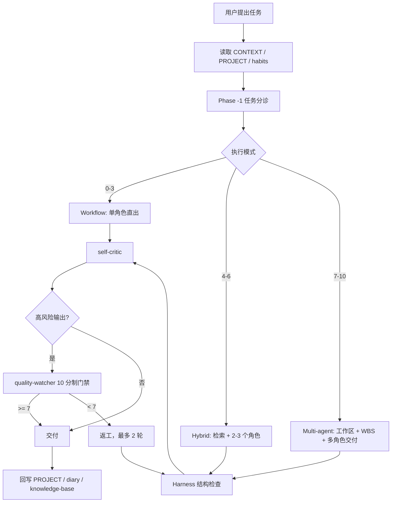

# 聚宝赞 PM Workspace

一个面向 AI IDE 的 Markdown-native 产品经理工作台。

它把一次次对话里的需求判断、PRD 产出、原型复刻、评审结论和项目经验沉淀成可检索、可复用、可审计的文件系统，让 AI 不再只靠“当前上下文”临场发挥。

> 适配：Antigravity、Claude Code、Cursor、Gemini CLI，以及任何能读取项目文件的 AI IDE。

## 为什么需要它

| 常见问题 | 这里怎么解决 |
|---|---|
| AI 每次会话都像从零开始 | 用 `.antigravity/`、`knowledge-base/`、`docs/` 承载长期状态与历史知识 |
| PRD / Demo 质量不稳定 | 用 Harness、self-critic、quality-watcher 做结构和质量门禁 |
| 需求评审容易漏掉技术、体验、测试盲点 | 用 `pm-orchestrator` 动态路由到 PRD、UX、技术、数据等专家角色 |
| 同类需求重复踩坑 | 用 `habits.md`、`patterns/`、`archives/` 沉淀规则与反模式 |
| 高保真原型改起来危险 | 用 SingleFile 工具链解包、注入、重装、校验，避免外链、截断和交互失效 |

## 核心工作流



## 目录总览

```text
pm-workspace/
├── .agent/                 # Agent、Skill、命令、规则与质量体系
├── .antigravity/           # 产品上下文、项目注册表、决策、日记、长期记忆
├── docs/                   # 进行中的分析、评审与 PRD 配套材料
├── inbox/                  # 未分流需求和临时输入
├── knowledge-base/         # 稳定知识：通用规则、业务模式、项目归档、指标
├── scripts/                # PowerShell 自动化、审计与目录生成
├── tools/singlefile/       # SingleFile 原型解包、重装与质量校验
├── GEMINI.md               # 全局运行规则与最高裁决口径
├── SKILL.md                # PM Orchestrator 快速入口
└── README.md               # 当前文档
```

## 各版块怎么运行

### `.agent/`：能力层

`.agent/` 定义这套工作台“谁能做什么、什么时候调用、怎么验收”。

| 子目录 / 文件 | 作用 |
|---|---|
| `ROLE-REGISTRY.md` | 所有可路由 agent / skill 的注册表。新增或重命名角色后必须同步这里 |
| `agents/` | 专家角色，如 `pm-orchestrator`、`prd-writer`、`ux-critic`、`tech-review`、`quality-watcher` |
| `skills/` | 公共方法，如需求澄清、知识检索、知识归档、知识扩散、日终收尾、SingleFile 预处理 |
| `commands/` | 高频入口，如 `/discover`、`/write-prd`、`/review-prd`、`/close-day` |
| `policies/` | 路由、质量门禁、结构 Harness、脚本治理、规则依赖图 |
| `playbooks/` | 编排清单，用来防止复杂任务漏掉回写、评审和同步 |
| `catalog/` | 由脚本自动生成的角色与命令索引 |
| `evals/` | 路由校准记录，用于观察分诊机制是否长期偏差 |

核心角色：

| 角色 | 什么时候用 | 主要产出 |
|---|---|---|
| `pm-orchestrator` | 多步骤、高风险、需回写或需多角色协作的任务 | 分诊表、WBS、执行汇总、复盘 |
| `prd-writer` | PRD 起草、改写、产品叙事重构 | 母型判断、PM-first PRD、配套技术文档指引 |
| `html-prototyper` | SingleFile 快照叠加新功能，或从零生成轻量原型 | `Demo.html`、场景图鉴 |
| `ux-critic` | 交互流程、异常态、用户理解成本评审 | UX 问题清单与修正建议 |
| `tech-review` | 技术方案、接口、数据结构的产品侧评审 | 技术承接风险与评审建议 |
| `quality-watcher` | 高风险交付物外部质量审查 | 10 分制评分、准入结论、返工建议 |
| `self-critic` | 所有实质性输出交付前自查 | 风险摘要与置信度 |

核心 Skill：

| Skill | 作用 |
|---|---|
| `knowledge-retriever` | 先读 `_index.md`，低 token 定位历史模式与相关项目 |
| `requirement-clarifier` | 写 PRD 前补齐目标角色、场景、问题、指标、边界、约束、依赖 |
| `thinking-framework` | 非简单任务前强制做影响面、价值链、架构约束三步思考 |
| `project-bootstrap` | 新项目或老项目纳管，补建 `PROJECT.md` 与注册表条目 |
| `knowledge-archivist` | 项目完成后生成归档卡并沉淀可复用模式 |
| `knowledge-propagator` | 规则变化后读取依赖图，检查受影响版块和项目 |
| `memory-curator` | 把高频纠错、用户偏好、术语和反模式写入长期记忆 |
| `daily-close` | 日终或长任务结束时，把结果回写到项目、diary 和同步面板 |
| `singlefile-to-dev` | 把 SingleFile 快照转成可修改、可重装、可离线交付的原型底座 |

### `.antigravity/`：状态层

`.antigravity/` 是运行时控制台，记录“当前产品是什么、项目做到哪、为什么这么决策、今天发生了什么”。

| 文件 / 目录 | 作用 |
|---|---|
| `CONTEXT.md` | 产品背景、业务域、客户画像、平台形态、术语表 |
| `projects/REGISTRY.md` | 所有项目的跨项目导航、状态和同步标记 |
| `projects/_template.md` | 新项目 `PROJECT.md` 模板 |
| `decisions/` | ADR 与关键取舍。记录为什么选这个方案，而不是只记录结果 |
| `diary/` | 按日期追加推进记录，方便跨会话恢复现场 |
| `memory/habits.md` | 长期 PM 习惯、偏好、事故复盘和防坑规则 |
| `entity-dictionary.md` | 统一实体命名，避免 PRD、Demo、知识库一物多名 |
| `sync-protocol.md` | 项目与知识库如何相互感知、哪些内容允许同步 |
| `workspaces/` | Multi-agent 或复杂任务的临时隔离工作区 |
| `reports/architecture-health/` | 自动健康巡检的最新报告与状态 |

关键原则：

- 项目目录是当前方案细节的真相源。
- `knowledge-base/` 是稳定规则的真相源。
- `decisions/` 记录原因。
- `diary/` 记录过程。
- `REGISTRY.md` 负责导航。

### `knowledge-base/`：知识层

`knowledge-base/` 不保存整份 PRD，而保存可复用、可检索、能指导后续项目的稳定知识。

| 子目录 / 文件 | 作用 |
|---|---|
| `_index.md` | 知识路由表。`knowledge-retriever` 先读这里，再按关键词进入具体文件 |
| `universal/` | 跨产品通用规则，如 SKU 状态机、购物车失效、结算守卫、状态阻断 |
| `patterns/` | 聚宝赞域内业务模式，如营销、联盟、私域商品、微页面、SingleFile 复刻 |
| `archives/` | 已交付项目的归档卡，记录核心决策、可复用结论、来源路径 |
| `metrics/` | 电商指标口径、漏斗基准、A/B 实验结构 |

当前知识路由覆盖：

- 电商通用：SKU 状态机、购物车失效、结算守卫。
- 交互通用：状态阻断、配额引导、异步批量导入。
- PM 方法：价值链梳理、影响面分析。
- 聚宝赞业务：联盟染色、联盟商品、订单归因、机构推广券、营销优惠券、微页面、私域商品规格。
- 原型复刻：SingleFile Iframe 沙箱、srcdoc 注入、离线封装与质量校验。

### `docs/`：进行中工作区

`docs/` 只放还在推进、评审或交付阶段的中间产物，不替代项目目录里的源 PRD。

| 子目录 | 适合放什么 |
|---|---|
| `analysis/` | 需求拆解、方案比较、开放问题、评审日志、审计记录 |
| `requirements/` | `implementation-notes.md`、`changelog.md`、`handoff-checklist.md` 等 PRD 配套材料 |
| `superpowers/` | 设计说明和执行计划等过程文件 |

### `inbox/`：收件箱

`inbox/` 用来接住还没决定归属的输入，例如临时需求、会议摘录、用户反馈、待核实问题。

处理规则：

1. 新条目按 `YYYY-MM-DD-topic.md` 命名。
2. 一旦进入正式推进，迁移到项目目录、`docs/` 或 `knowledge-base/`。
3. 被拒绝或暂不立项的需求放入 `inbox/rejected/`，保留重新评估条件。

### `scripts/` 与 `tools/`：自动化层

`scripts/` 只放可跨项目复用、无路径硬编码的 PowerShell 工具；`tools/` 放可复用 Python 工具。

常用命令：

```powershell
# Agent / Skill 元数据校验
powershell -ExecutionPolicy Bypass -File scripts/check-agent-metadata.ps1

# 重新生成 .agent/catalog/
powershell -ExecutionPolicy Bypass -File scripts/build-agent-catalog.ps1

# 交付前结构审计
powershell -ExecutionPolicy Bypass -File scripts/audit-antigravity.ps1

# 日常健康巡检
powershell -ExecutionPolicy Bypass -File scripts/run-architecture-watch.ps1 -Mode Daily

# 一键回归
powershell -ExecutionPolicy Bypass -File scripts/test-agent-library.ps1
```

SingleFile 工具链：

```powershell
# 解包 SingleFile 快照，生成可编辑底座
python tools/singlefile/sf-forge.py extract <source.html> <output_dir>

# 修改后重装为离线可交付 Demo
python tools/singlefile/sf-forge.py build <reviewable.html> <demo.html>

# 一键流水线
python tools/singlefile/pipeline.py <source.html> <output_dir>

# 检查原型是否存在外链、沙箱、体积、srcdoc 等风险
python tools/singlefile/check-singlefile-prototype.py <demo.html>
```

## 高频命令

| 命令 | 用途 | 默认链路 |
|---|---|---|
| `/discover` | 模糊方向探索，判断是否值得推进 | 知识检索 → 竞品/外部参考 → 需求澄清 → 自检 |
| `/write-prd` | 从背景和目标产出 PM-first PRD | 知识检索 → 澄清 → PRD 母型判断 → PRD → 质量门禁 |
| `/review-prd` | 对已有 PRD 做联合评审 | PRD 结构 → UX → 技术承接 → quality-watcher |
| `/sync-singlefile` | 把最新 SingleFile 快照转成原型开发底座 | 找快照 → 复制 source → 解包 → 准备 reviewable |
| `/close-day` | 日终或任务收尾 | daily-close → knowledge-propagator → memory-curator |
| `/weekly-review` | 横向扫描本周项目状态 | REGISTRY → diary → ROADMAP → 项目健康评分 |

## 当前已接入项目

项目详情以各项目目录中的 `PROJECT.md` 为准，`README.md` 只保留 GitHub 首页需要的导航索引。

| 项目 | 状态 | 项目控制面 | PRD | Demo |
|---|---|---|---|---|
| 微页面魔方组件 | active | `../原型/微页面/魔方组件/终稿/PROJECT.md` | `../原型/微页面/魔方组件/终稿/prd.md` | `../原型/微页面/魔方组件/终稿/demo.html` |
| 私域商品规格禁用 | launched | `../原型/商品/私域商品规格禁用/PROJECT.md` | `../原型/商品/私域商品规格禁用/PRD.md` | `../原型/商品/私域商品规格禁用/Demo.html` |
| 后台授权小程序数量限制 | active | `../原型/微页面/后台授权小程序数量限制/PROJECT.md` | `../原型/微页面/后台授权小程序数量限制/PRD.md` | `../原型/微页面/后台授权小程序数量限制/Demo.html` |
| 优惠券领取记录支持查询转赠人 | active | `../原型/营销/优惠券领取记录支持查询转赠人/PROJECT.md` | `../原型/营销/优惠券领取记录支持查询转赠人/PRD.md` | `../原型/营销/优惠券领取记录支持查询转赠人/demo.html` |
| 机构推广券支持获取分发机构的推广券 | review | `../原型/视频号/机构推广券支持获取分发机构的推广券/PROJECT.md` | `../原型/视频号/机构推广券支持获取分发机构的推广券/PRD.md` | `../原型/视频号/机构推广券支持获取分发机构的推广券/demo.html` |
| 批量售后服务配置 | active | `../原型/商品/批量售后服务配置/PROJECT.md` | `../原型/商品/批量售后服务配置/PRD.md` | `../原型/商品/批量售后服务配置/Demo.html` |
| 营销新增作废优惠券权限配置 | active | `../原型/营销/设置-营销新增作废优惠券功能权限配置/PROJECT.md` | `../原型/营销/设置-营销新增作废优惠券功能权限配置/PRD.md` | `../原型/营销/设置-营销新增作废优惠券功能权限配置/demo.html` |
| 优惠券有效期区间最多支持一年 | active | `../原型/营销/优惠券有效期区间最多支持一年/PROJECT.md` | `../原型/营销/优惠券有效期区间最多支持一年/PRD.md` | `../原型/营销/优惠券有效期区间最多支持一年/demo.html` |

## 质量体系

正式交付物按三层门禁走：

```text
Harness 结构检查
  -> self-critic 内部自查
  -> quality-watcher 外部评分
  -> 通过后交付并留证
```

| 层级 | 回答的问题 | 文件 |
|---|---|---|
| Harness | 结构对不对，必须章节和禁止项是否满足 | `.agent/policies/output-harness.md` |
| self-critic | 逻辑上有没有明显漏洞、盲点和低置信点 | `.agent/agents/self-critic/AGENT.md` |
| quality-watcher | 能不能交付，是否达到 7/10 准入线 | `.agent/agents/quality-watcher/AGENT.md` |
| Rubric Pack | PRD、Demo、UX、技术、数据等专项评分标准 | `.agent/policies/rubrics/` |

高风险输出包括：

- PRD 主文。
- 高保真 Demo / 1:1 UI 复刻。
- 跨模块原型或代码改造。
- 核心架构图。
- 正式评审或对外交付材料。

这些输出必须经过 `self-critic`，并由 `quality-watcher` 留下评分证据。低于 7 分必须返工，最多 2 轮。

## PRD 写作规则

PRD 不使用通用模板盲写，先判断需求母型。

| 母型 | 适合场景 | 标准结构 |
|---|---|---|
| 规则型 | 状态、权限、优惠、订单、结算等业务规则变化 | 8 章：文档信息、用户故事与价值、范围边界、全局业务规则、业务图、场景变更矩阵、关键页面交互、非功能与风险 |
| 交互型 | 新组件、新弹窗、新配置流程、新前台展示 | 10 章：文档信息、用户故事与价值、解决方案概述、核心功能需求、业务图、弹窗规格、前台展现规则、成功指标、超出范围、依赖与风险 |

技术实现细节默认不进入 PRD 主文。接口、字段、错误码、验收细节、开发补充说明应放到：

```text
pm-workspace/docs/requirements/<project-slug>/implementation-notes.md
```

## 项目与知识同步

这套工作台避免“项目目录”和“知识库”互相复制全文，只同步稳定结论。

| 方向 | 触发 | 动作 |
|---|---|---|
| 项目 -> 知识库 | PRD 稳定、原型完成、规则可复用、踩坑可复用 | 写入 `patterns/` 或 `archives/`，更新 `_index.md` |
| 知识库 -> 项目 | 公共规则、指标口径、实体定义变化 | 运行 `knowledge-propagator`，标记受影响项目 |
| 项目状态 -> 注册表 | 项目状态、路径、同步状态变化 | 更新 `PROJECT.md` 与 `REGISTRY.md` |
| 关键取舍 -> 决策记录 | 方案原因需要追溯 | 写入 `.antigravity/decisions/` |
| 每日推进 -> 日记 | 有实质推进或里程碑 | 追加 `.antigravity/diary/YYYY-MM-DD.md` |

## 快速开始

### 1. 克隆并打开目录

```bash
git clone <your-repo-url>
cd <your-repo>/pm-workspace
```

用 Antigravity、Claude Code、Cursor 或其他 AI IDE 打开 `pm-workspace/`。

### 2. 填写产品上下文

编辑：

```text
.antigravity/CONTEXT.md
```

至少补齐：

- 你的角色与负责业务域。
- 产品形态和目标用户。
- 核心术语。
- 默认分析框架或成功指标偏好。

### 3. 初始化知识路由

如果是新工作区，复制模板：

```bash
cp knowledge-base/_index-template.md knowledge-base/_index.md
```

### 4. 开始第一个需求

可以直接说：

```text
帮我立项：[需求名称]，背景是……
```

或使用稳定入口：

```text
/discover [业务背景]
/write-prd [需求背景]
/review-prd [PRD 路径]
/close-day [今天做了什么]
```

### 5. 交付前跑审计

从 `pm-workspace/` 目录执行：

```powershell
powershell -ExecutionPolicy Bypass -File scripts/test-agent-library.ps1
```

如果只做日常健康检查：

```powershell
powershell -ExecutionPolicy Bypass -File scripts/run-architecture-watch.ps1 -Mode Daily
```

## 发布到 GitHub 前的安全检查

这个工作区包含本地产品上下文、项目路径、日记、习惯记录和可能的测试环境信息。公开发布前建议先做一次清理。

重点检查：

- `.antigravity/memory/habits.md` 是否包含账号、密码、测试环境地址或内部口径。
- `.antigravity/CONTEXT.md` 是否适合公开。
- `.antigravity/diary/`、`.antigravity/decisions/` 是否包含内部项目细节。
- `docs/requirements/` 和 `docs/analysis/` 是否包含未公开需求。
- `knowledge-base/archives/` 是否暴露客户、商家或内部策略。

建议做法：

- 公共模板仓库只保留框架、示例和脱敏样例。
- 私有业务仓库保留真实 `CONTEXT.md`、`REGISTRY.md`、`habits.md` 和项目档案。
- 如需开源，先添加 `.gitignore` 或提供 `CONTEXT.example.md`、`REGISTRY.example.md`。

## 维护建议

- 新增 agent / skill 后，更新 `.agent/ROLE-REGISTRY.md`。
- 修改 `.agent/`、`GEMINI.md`、`habits.md`、`sync-protocol.md` 后，运行横向引用检查。
- 新增知识模式时，更新 `knowledge-base/_index.md`。
- 修改规则后，考虑运行 `knowledge-propagator` 检查受影响项目。
- 每个大任务结束后，至少检查：项目面板、注册表、diary、知识库、路由校准。

## 设计参考

README 结构参考了 GitHub 官方 README 建议、Google README 风格指南，以及 Awesome README 社区中常见的高星项目写法：首屏讲清项目价值，中段给快速开始和结构说明，后段放使用、维护、贡献和安全信息。

## License

当前目录未检测到 `LICENSE` 文件。若要公开发布，请先补充明确许可证。
