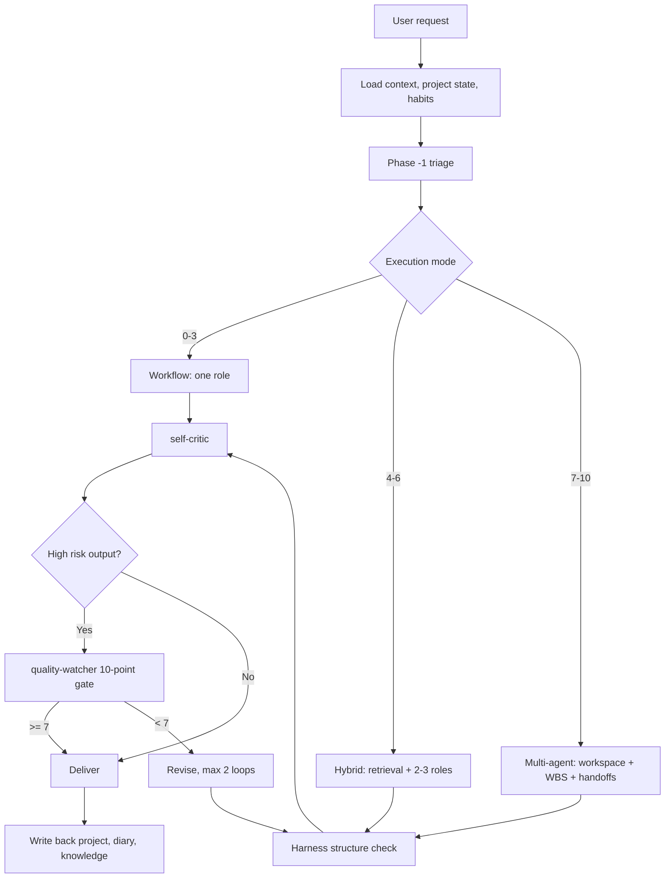

# PM Framework

A markdown-native product management workflow framework for AI IDEs.

PM Framework turns an AI coding IDE into a file-backed product management workspace: requirements, PRDs, prototype notes, review gates, decisions, project state, and reusable knowledge all live in ordinary Markdown files that can be versioned, searched, reviewed, and reused across sessions.

> Compatible with Antigravity, Claude Code, Cursor, Gemini CLI, and any AI IDE that can read project files.

## What It Solves

| Problem | Framework Mechanism |
|---|---|
| AI sessions lose context | `.antigravity/`, `docs/`, and `knowledge-base/` persist project state and reusable rules |
| PRD and prototype quality varies | Harness checks, `self-critic`, and `quality-watcher` enforce structure and quality gates |
| Reviews miss UX, technical, or QA risks | `pm-orchestrator` routes work to PRD, UX, technical, data, and quality roles |
| Similar projects repeat the same mistakes | `habits.md`, `patterns/`, and `archives/` preserve lessons and anti-patterns |
| High-fidelity HTML prototypes are fragile | SingleFile tooling extracts, rebuilds, and validates offline HTML demos |

## How It Works



## Repository Structure

```text
pm-framework/
├── pm-workspace/
│   ├── .agent/                 # Agents, skills, commands, policies, playbooks
│   ├── .antigravity/           # Templates for context, decisions, diary, memory, projects
│   ├── inbox/                  # Intake folder for untriaged requirements
│   ├── knowledge-base/         # Universal patterns and placeholders for private knowledge
│   ├── scripts/                # PowerShell audits and catalog generation
│   ├── tools/singlefile/       # SingleFile HTML extraction/build/check tools
│   ├── GEMINI.md               # Runtime rules for Gemini-compatible IDEs
│   ├── SKILL.md                # Orchestrator entry point
│   └── ONBOARDING.md           # Setup guide for a new product/team
├── .gitignore                  # Keeps private content out of the public repo
└── README.md
```

## Key Concepts

### Three Execution Modes

| Score | Mode | Use When |
|---:|---|---|
| 0-3 | Workflow | One clear task, one role, low risk |
| 4-6 | Hybrid | Needs retrieval, clarification, or 2-3 roles |
| 7-10 | Multi-agent | Cross-domain work, multiple deliverables, formal review |

High-risk outputs always go through at least Hybrid mode: PRDs, high-fidelity demos, core architecture diagrams, formal review materials, and external-facing deliverables.

### Quality Gates

```text
Draft
  -> Harness: required structure and forbidden content
  -> self-critic: internal risk and logic review
  -> quality-watcher: 10-point scoring for high-risk outputs
  -> Deliver or revise
```

### File-Backed Memory

| File or Folder | Purpose |
|---|---|
| `.antigravity/CONTEXT.md` | Private product/team context, created by the user after cloning |
| `.antigravity/projects/REGISTRY.md` | Private project index, created locally |
| `.antigravity/memory/habits.md` | Working preferences, anti-patterns, and lessons |
| `knowledge-base/_index.md` | Private knowledge router copied from `_index-template.md` |
| `knowledge-base/patterns/` | Reusable product/business rules |
| `knowledge-base/archives/` | Completed project knowledge cards |

Private content is intentionally ignored by Git unless it is a template or README.

## Quick Start

### 1. Clone

```bash
git clone <repo-url>
cd pm-framework
```

Open the repository in your AI IDE.

### 2. Create Product Context

Create `pm-workspace/.antigravity/CONTEXT.md`:

```markdown
# Product Context

## My Role
{role} @ {team/company}

## Product
- Name: {product name}
- Users: {target users}
- Platforms: {web / app / backend / other}
- Current stage: {0-to-1 / growth / optimization}

## Terms
- {term}: {definition}
```

### 3. Initialize Knowledge Router

```bash
cp pm-workspace/knowledge-base/_index-template.md pm-workspace/knowledge-base/_index.md
```

### 4. Start a Requirement

Ask your AI IDE:

```text
Help me start a project: [requirement name]. Background: ...
```

Or use a stable command:

```text
/discover [rough idea]
/write-prd [requirement background]
/review-prd [PRD path]
/close-day [what changed today]
```

## Common Commands

| Command | Purpose |
|---|---|
| `/discover` | Explore a vague idea before committing to a PRD |
| `/write-prd` | Retrieve history, clarify requirements, and draft a PM-first PRD |
| `/review-prd` | Run product, UX, technical, and quality review on an existing PRD |
| `/sync-singlefile` | Prepare a SingleFile HTML snapshot for prototype work |
| `/close-day` | Write back daily progress, decisions, and sync reminders |
| `/weekly-review` | Scan active projects and summarize weekly progress |

## Verification

From `pm-workspace/`:

```powershell
powershell -ExecutionPolicy Bypass -File scripts/check-agent-metadata.ps1
powershell -ExecutionPolicy Bypass -File scripts/build-agent-catalog.ps1
powershell -ExecutionPolicy Bypass -File scripts/test-agent-library.ps1
```

For routine workspace health:

```powershell
powershell -ExecutionPolicy Bypass -File scripts/run-architecture-watch.ps1 -Mode Daily
```

## Public Repository Safety

This repo is meant to be a reusable framework. Do not commit private product data.

The default `.gitignore` excludes:

- `pm-workspace/.antigravity/CONTEXT.md`
- project registries, decisions, diaries, workspaces, and reports
- private `knowledge-base/patterns/`, `archives/`, `metrics/`, and `_index.md`
- local product artifacts and prototypes

Before publishing a fork, scan for private terms, URLs, accounts, customer names, and local absolute paths. If private data was ever committed, start from a clean repository or rewrite Git history before publishing.

## License

MIT. See [LICENSE](LICENSE).
